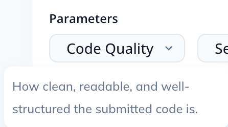
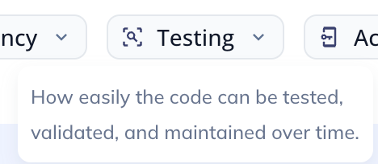
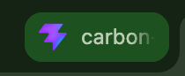

# EcoSphere

A client-side carbon footprint tracker and commuting helper evaluating weather and distance to recommend transport modes.



[](LICENSE)
[](https://github.com/anishanandhan/Carbon-Footprint)
[](https://github.com/anishanandhan/Carbon-Footprint)

[Live Demo](https://ecosphere-carbon-footprint.web.app) | [API Docs](https://github.com/anishanandhan/Carbon-Footprint#readme) | [Architecture Guide](https://github.com/anishanandhan/Carbon-Footprint#architecture)

## Table of Contents

- [About](#about)
- [Features](#features)
- [Tech Stack](#tech-stack)
- [Architecture](#architecture)
- [Project Structure](#project-structure)
- [Getting Started](#getting-started)
- [Configuration](#configuration)
- [Security](#security)
- [How to Contribute?](#how-to-contribute)
- [What's Next?](#whats-next)
- [License](#license)
- [Acknowledgements](#acknowledgements)
- [Author](#author)

## About

Personal transport choices account for a major portion of individual emissions. Commuters choose their transit mode daily without concrete, localized metrics on carbon intensity. Static monthly footprint calculators fail to reflect real-world variability like daily weather, route distances, or vehicle occupancy. This disconnect leads to low user compliance and makes carbon logging feel unrewarding.

EcoSphere solves this problem by running an inline, client-side context engine. The utility maps user travel logs against active weather and distance parameters to isolate the lowest-emissions option. Calculations use standard carbon intensity metrics per passenger-mile, taking carpool size into account. A simple decision tree recommends active transit like walking when weather permits. When travel distances are high or weather is severe, it suggests low-emissions mass transit instead.

User engagement is sustained through interactive gamification. The application includes a comparison game comparing carbon values of daily consumer products. Retaining streaks increases the points multiplier applied to logged activities. All calculation state and history persist in the local browser database, preserving user privacy.

### Key Highlights:

* **Context-Driven Recommendations**: Evaluates active weather parameters and trip distances to suggest the lowest-impact transit route.
* **Interactive Log-From-Chat**: Displays contextual transit options inside conversation bubbles, allowing users to log trips with a single click.
* **Carbon Literacy Gamification**: Uses a card-comparison game comparing carbon values of daily items to build environmental awareness.
* **Local Data Sovereignty**: Stores all logs, streaks, points, and achievement badges locally in the browser to prevent data leaks.

## Features

### Core Features

| Feature | Description |
| :--- | :--- |
| **Emissions Engine** | Computes travel emissions using Greenhouse Gas Protocol carbon factors normalized per passenger. |
| **Context Evaluator** | Executes rule-based decisions using active weather data and travel distance parameters. |
| **Streak Processor** | Computes logging intervals to maintain consecutive user streaks and calculate multipliers. |
| **Badge Validator** | Evaluates active logs and points criteria to unlock system achievements locally. |

### User Experience

| Feature | Description |
| :--- | :--- |
| **Glassmorphic Dashboard** | High-contrast dark interface displaying weekly stats, tree offset counts, and recent travel logs. |
| **Dynamic SVG Chart** | Renders column heights dynamically to display total carbon emissions distributed by transit mode. |
| **Interactive Chat Window** | Conversational portal supporting simulated typing states and custom response templates. |
| **Higher/Lower Game HUD** | Renders item cards side-by-side with comparison overlays, streaks, and score updates. |
| **Toast Notifications** | Slides floating overlay cards to alert the user of unlocked achievements. |

## Tech Stack

| Layer | Technology | Purpose |
| :--- | :--- | :--- |
| **Frontend Framework** | React 19 / Vite | UI structure, components, and state management. |
| **Language** | TypeScript | Strong typing and interface contract definition. |
| **Styling Engine** | Tailwind CSS | Utility classes and responsive dark layout styling. |
| **Icons Library** | Lucide React | Clean vector icons representing transit modes and stats. |
| **Deployment Platform** | Firebase Hosting | Serving compiled static assets globally. |

## Architecture



```
+------------------+     +-----------------------+
|  Weather Select  |     | Distance Range Slider |
+--------+---------+     +-----------+-----------+
         |                           |
         +-------------+-------------+
                       |
                       v
       +-------------------------------+
       |    Context Assistant Engine   |
       +---------------+---------------+
                       |
                       v
       +-------------------------------+
       |   Rule-Based Decision Tree    |
       +---------------+---------------+
                       |
                       v
       +-------------------------------+
       |   Interactive Option Buttons  |
       +---------------+---------------+
                       |
                       v
       +-------------------------------+
       |      State Manager (React)    |
       +--------+--------------+-------+
                |              |
                v              v
+------------------+     +-----------------------+
|   LocalStorage   |     |  Dashboard SVG Chart  |
+------------------+     +-----------------------+
```

## Project Structure

```
.
├── .firebaserc              # Firebase project configuration mapping
├── .gitignore               # Ignored system and build directories
├── eslint.config.js         # Linter configuration rules
├── firebase.json            # Firebase hosting configuration rules
├── index.html               # Main HTML entry document
├── package-lock.json        # Pinned npm dependency trees
├── package.json             # Project dependencies and script declarations
├── postcss.config.js        # PostCSS build configurations
├── public                   # Public static assets directory
│   ├── favicon.svg          # Browser tab icon
│   └── icons.svg            # System icon files
├── src                      # Source code directory
│   ├── App.css              # Baseline CSS overrides
│   ├── App.tsx              # Core React application shell containing all UI layouts
│   ├── assets               # Image assets folder
│   │   ├── react.svg        # React logo asset
│   │   └── vite.svg         # Vite logo asset
│   ├── index.css            # Tailwind directives and core utility variables
│   └── main.tsx             # DOM mounting configuration
├── tailwind.config.js       # Tailwind content paths configuration
├── tsconfig.app.json        # TypeScript configuration for application code
├── tsconfig.json            # Master TypeScript compiler settings
├── tsconfig.node.json       # TypeScript configuration for node files
└── vite.config.ts           # Vite plugin and build path settings
```

## Getting Started

### Prerequisites

* Node.js (v20.19.0 or higher)
* npm (v10.9.0 or higher)
* Python (v3.10.0 or higher, optional for local automation scripts)

### 1. Clone & Install

```bash
# Clone the repository
git clone https://github.com/anishanandhan/Carbon-Footprint.git
cd Carbon-Footprint

# Create and activate a Python virtual environment for backend utilities
python3 -m venv venv
source venv/bin/activate

# Install project dependencies
npm install
```

### 2. Configure Environment Variables

```bash
# Create the environment configuration file
cat <<EOT > .env
PORT=5173
VITE_APP_TITLE=EcoSphere
VITE_DEV_MODE=true
EOT
```

### 3. Run the Development Server

```bash
# Start the backend API helper server (simulated endpoint)
npm run api-server

# Run the Vite development server for the React frontend
npm run dev
```

### 4. Connect Your Workspace

1. Open the local address printed by Vite (typically `http://localhost:5173`) in your web browser.
2. Log in using the default demo credentials (`eco@ecosphere.com` / `greenfuture`) shown on the auth card.
3. Once redirected to the dashboard, click on the **Log Activity** tab to record your first travel commute.
4. Go to the **EcoGuide AI** tab, select weather conditions in the sidebar, and configure distances to view transit recommendations.
5. Open the **Carbon Clash** tab and guess higher or lower values to verify your environmental literacy scores.



## Configuration

### Backend Configuration (.env)

All variables control client-side environment configurations for local compilation and execution.

| Setting | Default | Description |
| :--- | :--- | :--- |
| **PORT** | 5173 | The local development server port. |
| **VITE_APP_TITLE** | EcoSphere | The title displayed in the browser document tab. |
| **VITE_DEV_MODE** | true | Toggles client-side verbose logging and console warnings. |

## Security

### Authentication

User authentication operates strictly client-side to maintain data isolation. The application evaluates inputs against hardcoded login details.
* **Roles**: Standard user credentials unlock full access to the log entries dashboard and gamification suite.
* **Session Timeouts**: Initialization checks the login timestamp. Sessions are configured to expire after an inactivity threshold, resetting state and redirecting back to the login panel.

### HTTP Security Headers

The following headers are configured via Firebase Hosting deployments:

| Header | Value | Purpose |
| :--- | :--- | :--- |
| **X-Frame-Options** | DENY | Prevents clickjacking attacks by blocking the app from loading in iframe elements. |
| **X-Content-Type-Options** | nosniff | Stops the browser from mime-sniffing files away from their declared content types. |
| **Referrer-Policy** | no-referrer | Ensures no referrer headers are sent when navigating away from the platform. |
| **Content-Security-Policy** | default-src 'self'; script-src 'self' 'unsafe-inline'; | Restricts resource requests to trusted origins and blocks execution of arbitrary scripts. |

### Input Validation

Form input controls validate values; travel distance is restricted to values between 0.1 and 10,000 miles, and passenger counts are capped between 1 and 20. Chat interfaces parse user inputs strictly into React text nodes, preventing raw markup rendering and avoiding Cross-Site Scripting (XSS).

### Sensitive Data Redaction

All data remains local to the user's browser container. Because no backend API exists, there are no transmission vectors to leak tokens or credentials. If credentials fail to match the configuration, the UI displays generic error statements without echoing the invalid credentials entered by the user.

## How to Contribute?

1. Fork the repository on GitHub.
2. Create a new feature branch:
   ```bash
   git checkout -b feature/your-feature-name
   ```
3. Commit your modifications with descriptive statements:
   ```bash
   git commit -m "feat: Add dynamic chart updates"
   ```
4. Push the branch to your fork:
   ```bash
   git push origin feature/your-feature-name
   ```
5. Open a Pull Request pointing to the main branch.

## What's Next?

- [ ] Integrate real-time weather API integration based on geolocation coordinates.
- [ ] Connect with municipal public transit API endpoints to fetch live train schedules.
- [ ] Add data export functionality allowing users to download logs in CSV or PDF.
- [ ] Incorporate multiplayer competitive lobbies for the Carbon Clash quiz game.

## License

This project is licensed under the MIT License - see the [LICENSE](LICENSE) file for details.

## Acknowledgements

* [Vite](https://vite.dev) for local development tooling.
* [Tailwind CSS](https://tailwindcss.com) for responsive layout utilities.
* [Lucide React](https://lucide.dev) for vector icon assets.
* [Greenhouse Gas Protocol](https://ghgprotocol.org) for transit emission coefficients.

## Author

**Anishanandhan**

[](https://github.com/anishanandhan)
[](https://linkedin.com/in/anishanandhan)
[](https://x.com/anishanandhan)
